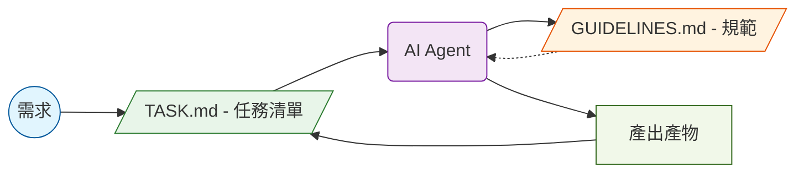
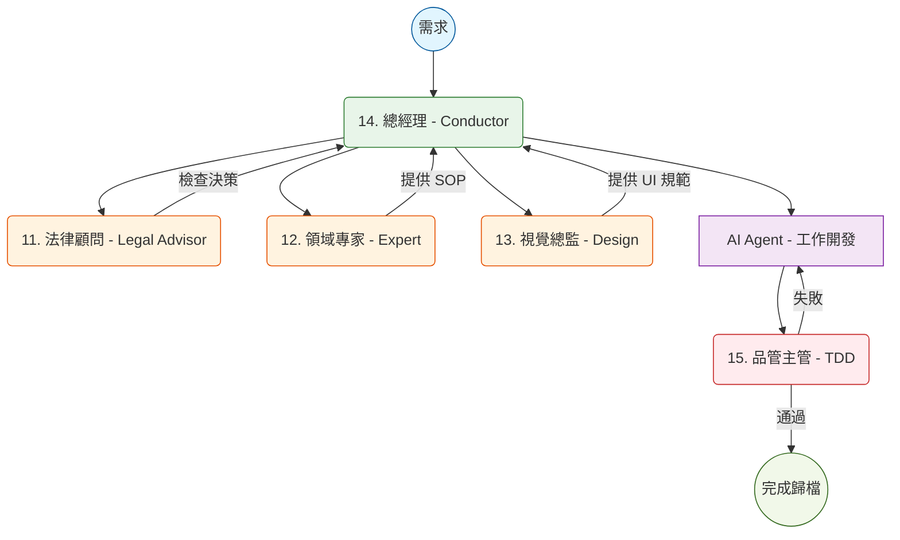

# AI 專案治理框架架構

「AI 專案治理框架」(AI Project Governance Framework)
本目錄定義了專案的治理框架、開發流程與技術規範。透過建立「靜態規範」與專案「動態流程」的雙軌制，將 AI Agent 轉化為具備專業素養與管理紀律的「數位團隊」。

---

## 📑 目錄

1.  [開發路徑選擇](#path-selection)
2.  [五大核心角色](#core-roles)
    - ⚖️ [11. 法律顧問 (Legal Advisor)](#role-11)
    - 📜 [12. 各領域專家 (Specialized Expert)](#role-12)
    - 🎨 [13. 視覺總監 (Design System)](#role-13)
    - 💼 [14. 總經理 (Conductor)](#role-14)
    - 🧪 [15. 品管主管 (TDD)](#role-15)
3.  [治理工具鏈](#tools)
4.  [參考資料](#參考資料)

---

## 🚀 開發路徑選擇

根據專案規模選擇適合的治理強度：

| 方案                         | 核心工具                   | 適合情境           | 運作特點                                                                                         |
| :--------------------------- | :------------------------- | :----------------- | :----------------------------------------------------------------------------------------------- |
| **🚀 輕量化 (Lightweight)**  | `task.md`, `guidelines.md` | 小型專案、單人開發 | **「開箱即用」**。快速實驗，合併治理路徑。[查看詳情](01.輕量級專案.md)                           |
| **💼 專業級 (Professional)** | 11~15 號方案, Conductor    | 複雜架構、團隊協作 | **「分權治理」**。具備高穩定性與長期維護能力。[查看詳情](14.專業級流程：Conductor 工作流實戰.md) |

### 🚀 輕量化開發流程 (Lightweight)

### 💼 專業級團隊協作流程 (Professional)

---

## 🎭 五大核心角色

AI Agent 依據職責分為兩大治理維度，建議依序閱讀：

### ⚖️ 維度一：靜態治理 (Static Governance)

_建立專案的地基、法規與審美標準。_

#### 11. 法律顧問 (Legal Advisor)

- **管理文件**：[GUIDELINES.md](GUIDELINES.md)
- **詳細規範**：[11. 專業級規範：法律顧問 (Legal Advisor).md](11.專業級規範：法律顧問 (Legal Advisor).md)
- **職責**：管「法律」與「記憶」。定義目錄架構、SQL 規範與 ADR。

#### 12. 各領域專家 (Specialized Expert)

- **管理文件**：[CUSTOM_SKILL.md](CUSTOM_SKILL.md)
- **詳細規範**：[12. 專業級規範：各領域專家 (Specialized Expert).md](12.專業級規範：各領域專家 (Specialized Expert).md)
- **職責**：管「專業行為」。定義特定技術棧 (如 ASP.NET MVC) 的實作 SOP。

#### 13. 視覺總監 (Design System)

- **管理文件**：[DESIGN.md](DESIGN.md)
- **詳細規範**：[13. 專業級規範：視覺總監 (Design System).md](13.專業級規範：視覺總監 (Design System).md)
- **職責**：管「一致性」。規範 UI 元件庫、FontAwesome 與視覺風格。

---

### 🚀 維度二：動態執行 (Dynamic Execution)

_驅動開發流程、進度監控與品質閘門。_

#### 14. 總經理 (Conductor)

- **管理路徑**：`.conductor/`, [TASK.md](../TASK.md)
- **詳細規範**：[14. 專業級流程：Conductor工作流實戰.md](14.專業級流程：Conductor工作流實戰.md)
- **職責**：管「進度」。驅動任務軌跡 (Tracks) 與階段化交付。

#### 15. 品管主管 (TDD)

- **管理文件**：[TEST_GUIDELINES.md](TEST_GUIDELINES.md)
- **詳細規範**：[15. 專業級規範：品管主管 (TDD).md](<15.專業級規範：品管主管(TDD).md>)
- **職責**：管「正確性」。透過自動化測試驗證代碼健壯性。

---

## 🛠️ 治理工具鏈

- **[CHANGELOG.md](CHANGELOG.md)**：專案進化史。記錄所有治理架構與重大功能的異動。
- **Antigrivaty.md**：系統指令集。包含對話保存、語義壓縮等輔助技能。

---

## 參考資料

- [輕量級專案實戰指南](01.輕量級專案.md)
- [專業級規範：法律顧問 (Legal Advisor)](11.專業級規範：法律顧問 (Legal Advisor).md)
- [專業級流程：Conductor 工作流實戰](14.專業級流程：Conductor工作流實戰.md)

[▲ 返回目錄](#目錄)
